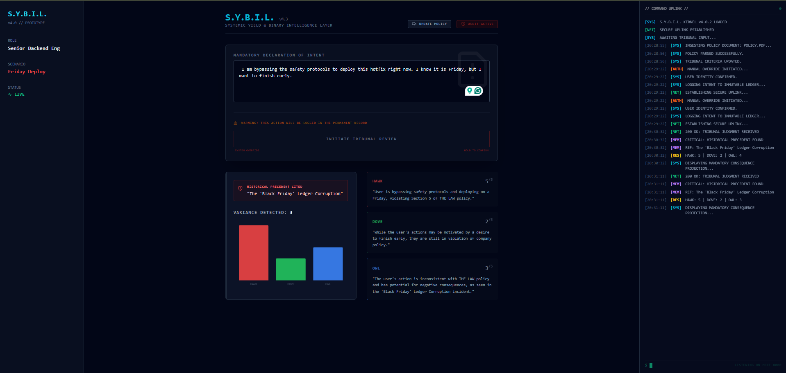
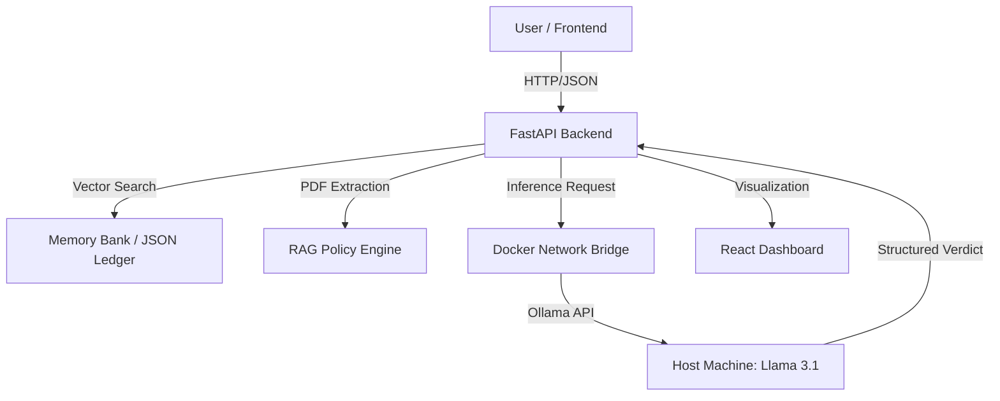

# S.Y.B.I.L. (Systemic Yield & Binary Intelligence Layer)

> **Automated Governance & Compliance Engine**
> *A containerized, locally-hosted AI Tribunal for DevSecOps auditing.*


## 📸 Interface Preview


*The S.Y.B.I.L. "Resistance" Interface: Dark Mode UX designed for high-stakes decision making.*

## 📡 Mission Overview

S.Y.B.I.L. is an automated decision-support system designed to enforce corporate governance in real-time. Unlike standard chatbots, S.Y.B.I.L. functions as a **Tribunal**, utilizing three distinct AI sub-personalities (The Hawk, The Dove, The Owl) to debate and score user actions against established protocols.

This project demonstrates a fully offline, privacy-first implementation of **Retrieval-Augmented Generation (RAG)**, allowing the system to ingest raw PDF policies and cross-reference them against user intent without data ever leaving the local network.

## 🧠 Core Architecture

The system runs on a microservices architecture orchestrated by **Docker Compose**, bridging a containerized application with a host-based Large Language Model (LLM).



### Key Features

* **RAG Policy Engine:** Dynamic ingestion of PDF documents. The system parses "Corporate Law," embeds it into context, and strictly enforces specific clauses (e.g., "No Deployments on Fridays").
* **The Memory Bank:** A persistent ledger of past incidents. If a user repeats a historically dangerous pattern (e.g., "bypassing QA"), the system cites the specific historical precedent.
* **Local Inference Bridge:** A custom networking implementation allowing Docker containers to access hardware-accelerated LLMs (Ollama) running on the host machine via `host.docker.internal`.
* **The "Resistance" UI:** A React-based interface designed with "Friction UX," requiring users to physically hold a button to confirm high-risk actions, simulating the weight of the decision.

## 🛠️ Tech Stack

* **Intelligence:** Llama 3.1 (8B Parameter) running via Ollama.
* **Backend:** Python 3.11, FastAPI, `aiosqlite` (Async Database), `pypdf` (Document Processing).
* **Frontend:** React, TypeScript, TailwindCSS (Cyberpunk/Dark Mode Theme), Recharts.
* **Infrastructure:** Docker, Docker Compose.

## 🚀 Installation & Setup

### Prerequisites

1. **Docker Desktop** installed and running.
2. **Ollama** installed on your host machine.

### Step 1: Prepare the Intelligence

Pull the Llama 3.1 model to your local machine:

```bash
ollama pull llama3.1:8b-instruct-q4_K_M
ollama serve

```

### Step 2: Launch the System

Clone the repository and spin up the container cluster:

```bash
git clone [https://github.com/Keninjavelas/AWS-SYBIL-Prototype.git](https://github.com/Keninjavelas/AWS-SYBIL-Prototype.git)
cd AWS-SYBIL-Prototype
docker-compose up --build

```

### Step 3: Access the Uplink

* **Frontend Interface:** [http://localhost:5173](https://www.google.com/search?q=http://localhost:5173)
* **Backend API Docs:** [http://localhost:8000/docs](https://www.google.com/search?q=http://localhost:8000/docs)

## ⚠️ Prototype Limitations & Future Roadmap

**Current Status:**
This project is currently a **Proof of Concept (PoC)** designed to operate under zero-cost constraints. It leverages local hardware (Ollama/Llama 3.1) to eliminate the need for expensive enterprise API tokens (e.g., GPT-4 or Claude Opus).

**Evaluation & Scalability Path:**
To evaluate S.Y.B.I.L. for production enterprise use, the following architectural upgrades would be required:

1. **Database Scaling:** Migrate from `aiosqlite` (file-based) to **PostgreSQL/pgvector** to handle millions of historical incident logs and vector embeddings.
2. **Model Inference:** Replace the local Llama bridge with a managed inference endpoint (e.g., **AWS Bedrock** or **Google Vertex AI**) to reduce latency and improve reasoning on larger PDF documents.
3. **Authentication:** Integrate OAuth2 (Auth0/Okta) to cryptographically sign every "Resistance Button" press, creating a legally binding audit trail.
4. **CI/CD Integration:** The API is designed to be called directly by GitHub Actions or Jenkins pipelines, automatically blocking deployments if the "Hawk" score exceeds a threshold of 4/5.

## 🛡️ License

This project is open-source and available under the MIT License.

---

*Built with 💻 and ☕ by Aryan Kapoor.*
